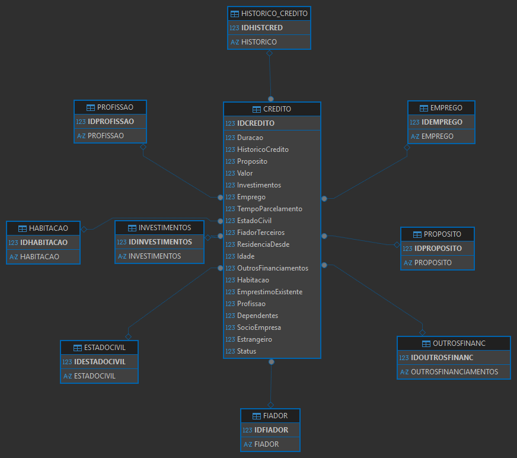

# 💳 Credit Risk Prediction using Machine Learning

Developed an end-to-end credit risk prediction solution to support loan approval decisions, reducing the estimated default rate through machine learning, SQL data modeling, explainable AI, and business intelligence dashboards.


---

## 📖 About

This project presents an end-to-end Credit Risk Prediction solution developed to support loan approval decisions using Machine Learning.

The project covers the complete Data Science lifecycle, including database modeling, data cleaning, exploratory data analysis, feature engineering, predictive modeling, model evaluation, explainable AI (SHAP), and business intelligence dashboards.

The final model was developed using XGBoost and optimized to support credit risk assessment while meeting business objectives for reducing default rates.


---

## 🏗️ Project Architecture

The project was developed following an end-to-end Data Science workflow, covering every stage from data storage to business decision support.

```
                PostgreSQL Database
                        │
                        ▼
              Data Cleaning & SQL Modeling
                        │
                        ▼
          Exploratory Data Analysis (EDA)
                        │
                        ▼
            Data Preprocessing Pipeline
                        │
                        ▼
      Logistic Regression & XGBoost Models
                        │
                        ▼
          Model Evaluation & Threshold Tuning
                        │
                        ▼
           Explainability with SHAP Values
                        │
                        ▼
             Interactive Tableau Dashboard
```
The solution integrates multiple stages of the data lifecycle, from raw credit information storage to predictive insights that support loan approval decisions.

---

## 🎯 Business Problem

Financial institutions face the challenge of balancing loan approvals and credit risk management. Approving high-risk customers can increase default rates, while excessive restrictions may reduce business opportunities.

The objective of this project is to develop a Machine Learning model capable of predicting customer default risk before loan approval.

The solution aims to support credit analysts by providing a data-driven risk assessment, helping reduce the estimated default rate and improve decision-making during the credit approval process.

The business goal established for this project was to reduce the default rate from approximately 35% to below 25%, creating a more efficient and risk-aware credit evaluation process.

---

## 🗄️ Database Modeling

The project uses PostgreSQL as the database management system to organize and structure credit information before applying Machine Learning techniques.

The database was designed using relational modeling principles, including:

- Primary Keys (PK)
- Foreign Keys (FK)
- Data normalization
- Relationship management between entities

The original dataset was transformed into a structured relational database, separating categorical information into reference tables to improve organization, consistency, and data quality.

### Database Structure

Main entities:

```text
                    PROFISSAO
                        │
                        │
                    EMPREGO
                        │
                        │
                    HABITACAO
                        │
                        │
                    CREDITO
                        │
                        │
              HISTORICO_CREDITO
                        │
                        │
                 PROPOSITO
                        │
                        │
                 INVESTIMENTOS
```

The main credit table contains customer information, loan characteristics, and the target variable used for prediction:

- Credit information
- Customer profile
- Loan conditions
- Default status

The structured database provided a reliable foundation for exploratory analysis and machine learning modeling.

---

## 🗄️ Database Modeling

The project database was structured using PostgreSQL following relational database modeling principles.

The database uses primary keys and foreign keys to maintain data integrity and relationships between credit information and categorical reference tables.

The Entity Relationship Diagram (ERD) below represents the final database structure:

